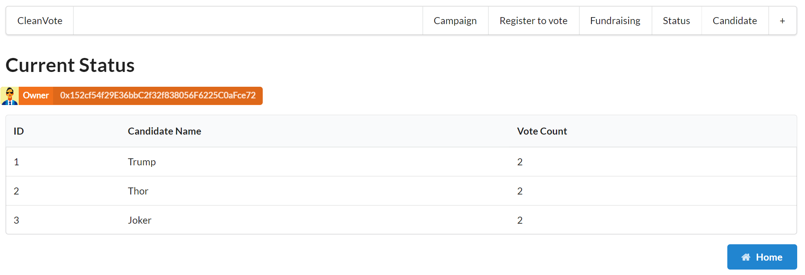

# Clear Vote
이더리움의 솔리디티언어를 이용하여 투표할 수 있는 스마트 컨트랙 및 DApp을 만들었습니다. 

## Architecture
Clear Vote 앱의 Architecture는 다음과 같습니다. Voting 기능을 수행하는 스마트 컨트랙을 작성하여 이더리움의 Rinkeby 네트워크에 배포를 했고, Web3.js를 이용하여 Ethereum과 통신합니다. 

## DApp의 모습
프론드엔드 구성은 [React](https://reactjs.org/)를 이용하였고, 서버사이드 랜더링을 위해 [Next](https://nextjs.org/)를 함께 사용하였습니다. 투표를 할 수 있는 메인화면과, 현재 누가 가장 많은 표를 얻었는지 확인할 수 있는 Status 화면, 새로운 후보를 등록할 수 있는 Candidate 화면으로 구성되었습니다. Campaign 및 Register to vote는 아직 구현하지 못하였습니다. 

[Home]

원하는 후보를 선택하고 Voter 옆의 텍스트박스에 자신의 Rinkeby Account 주소를 넣으면 투표하실 수 있습니다.

[Status] 

Status 버튼을 누르시면 누가 가장 많은 표를 얻었는지 실시간으로 확인하실 수 있습니다. 

[Candidate]

Candidate 화면에서는 새로운 후보를 등록할 수 있습니다. 단, 새로운 후보 등록은 Owner만이 할 수 있도록 제한되어 있습니다. (즉, 메인화면에서 주황색 박스에 표기되어있는 **0x152cf54f29E36bbC2f32f838056F6225C0aFce72** 주소의 주인만이 후보자 등록을 할 수 있습니다.)

# Contributing
CleanVote 프로젝트에는 아래 사진의 판타스틱4 멤버들이 함께했습니다. 
* [Kwon Lee](https://github.com/kay2live)
* [Hyundong Kim](https://github.com/hyundonk)
* [May Kim](https://github.com/maykim51)
* [Eunji Kim](https://github.com/angie4u) 

